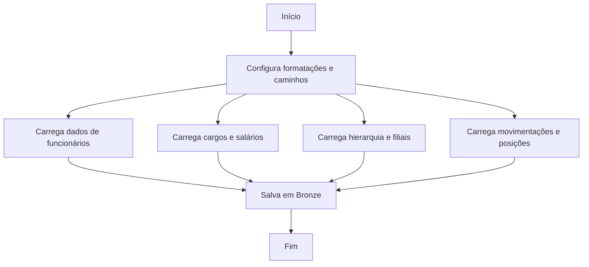

# Documentação Técnica

**Arquivo:** `bz_headcount.qvs`  
**Última atualização:** 15/08/2025 11:52:02

# **Documentação do Script QVS – Processamento de Dados de Recursos Humanos**

## **1. Introdução**
Este documento explica, de forma clara e organizada, o funcionamento de um script utilizado para processar e preparar dados relacionados a **Recursos Humanos (RH)**. O script é escrito em uma linguagem chamada **QVS** (usada na ferramenta **QlikView/Qlik Sense**), que serve para extrair, transformar e armazenar informações de maneira estruturada.

O objetivo principal deste script é **coletar dados de diferentes fontes** (como planilhas e arquivos internos) e **organizá-los em um formato padronizado**, facilitando sua análise posterior.

---

## **2. Configurações Iniciais**
Antes de processar os dados, o script define algumas **configurações básicas** para garantir que números, datas, moedas e textos sejam exibidos corretamente, de acordo com o padrão brasileiro.

### **2.1. Formatação de Números, Moedas e Datas**
| Configuração | Descrição | Exemplo |
|--------------|-----------|---------|
| **ThousandSep** | Separador de milhar (ponto) | `1.000` (mil) |
| **DecimalSep** | Separador decimal (vírgula) | `3,14` (três vírgula quatorze) |
| **MoneyFormat** | Formato de moeda (Real - R$) | `R$1.234,56` |
| **DateFormat** | Formato de data | `31.12.2023` (dia.mês.ano) |
| **TimeFormat** | Formato de hora | `14:30:45` |
| **TimestampFormat** | Formato de data e hora completos | `31/12/2023 14:30:45` |
| **CollationLocale** | Idioma para ordenação de textos | `pt-BR` (Português do Brasil) |

### **2.2. Configurações de Calendário**
| Configuração | Descrição |
|--------------|-----------|
| **FirstWeekDay** | Primeiro dia da semana (6 = domingo) |
| **FirstMonthOfYear** | Primeiro mês do ano (1 = janeiro) |
| **MonthNames** | Nomes abreviados dos meses (ex: `jan`, `fev`) |
| **LongMonthNames** | Nomes completos dos meses (ex: `janeiro`, `fevereiro`) |
| **DayNames** | Dias da semana abreviados (ex: `seg`, `ter`) |
| **LongDayNames** | Dias da semana por extenso (ex: `segunda-feira`) |

### **2.3. Configurações de Unidades Numéricas**
Define abreviações para valores grandes ou pequenos, como:
- `k` = mil (`1.000`)
- `M` = milhão (`1.000.000`)
- `m` = milésimo (`0,001`)

---

## **3. Definição dos Caminhos de Arquivos**
O script define **pastas (ou "caminhos")** onde os dados serão **lidos** e **salvos**. Essas pastas são organizadas em **camadas** (Bronze, Silver, Gold), que representam diferentes estágios de preparação dos dados:

| Variável | Descrição | Exemplo de Caminho |
|----------|-----------|---------------------|
| **bronze_layer** | Local onde os dados **brutos** (sem tratamento) são armazenados. | `lib://Eldorado Data Folder/.../01. Bronze/` |
| **silver_layer** | Local para dados **parcialmente tratados**. | `lib://Eldorado Data Folder/.../02. Silver/` |
| **gold_layer** | Local para dados **prontos para análise**. | `lib://Eldorado Data Folder/.../03. Gold/` |
| **manual_source** | Pasta com **planilhas manuais** (Excel). | `lib://Eldorado Data Folder/.../02. Manual Source/` |
| **ti_layer** | Dados extraídos de **sistemas internos** (como SAP). | `lib://Staging Recursos Humanos/` |
| **external_layer** | Dados de **fontes externas**. | `lib://Eldorado Data Folder/.../04. Fontes Externas/` |

---
## **4. Processamento dos Dados**
O script **carrega dados de diferentes fontes**, como arquivos `.qvd` (formato do Qlik) e planilhas `.xlsx` (Excel), e os **armazena na camada Bronze** para uso futuro.

Cada seção do script é responsável por **um tipo específico de dado**, como:
- **Headcount** (número de funcionários)
- **Salários**
- **Hierarquia organizacional**
- **Cargos e funções**
- **Centros de custo**
- **Movimentações de funcionários**

Abaixo, detalhamos cada parte:

---

### **4.1. Headcount (Número de Funcionários)**
#### **a) Headcount Atual (bz_headcount_f)**
- **O que faz?**
  Carrega dados do **número atual de funcionários** de um arquivo interno (`0STA_RHRMV012_001.qvd`).
- **Para que serve?**
  Saber quantos funcionários a empresa tem **hoje**.
- **Onde salva?**
  Na camada **Bronze**, como `bz_headcount_f.QVD`.

#### **b) Headcount Histórico (2014 a 2018) (bz_headcount_hist_f)**
- **O que faz?**
  Carrega dados históricos de funcionários de uma **planilha Excel** (`hc_historica_f.xlsx`).
- **Para que serve?**
  Analisar a **evolução do número de funcionários** ao longo dos anos.
- **Onde salva?**
  Na camada **Bronze**, como `bz_headcount_hist_f.QVD`.

#### **c) Headcount Mais Recente (bz_headcount_latest_f)**
- **O que faz?**
  Carrega informações **detalhadas dos funcionários** (como salários e códigos) de um arquivo interno (`0STA_DRMFUNSAL_001.qvd`).
- **Para que serve?**
  Ter uma visão **atualizada e detalhada** de cada funcionário.
- **Onde salva?**
  Na camada **Bronze**, como `bz_headcount_latest_f.QVD`.

---

### **4.2. Dados de Pessoas (bz_pessoa_d)**
- **O que faz?**
  Carrega informações **pessoais dos funcionários** (como nome, documento, dados cadastrais) de um arquivo interno (`0STA_DRMPESSOA_001.qvd`).
- **Para que serve?**
  Manter um **cadastro completo** de cada colaborador.
- **Onde salva?**
  Na camada **Bronze**, como `bz_pessoa_d.QVD`.

---

### **4.3. Hierarquia Organizacional (bz_hierarquia_d)**
- **O que faz?**
  Carrega dados sobre a **estrutura hierárquica** da empresa (quem reporta a quem, cargos, departamentos).
- **Para que serve?**
  Entender a **organização interna** e as relações entre áreas.
- **Onde salva?**
  Na camada **Bronze**, como `bz_hierarquia_d.QVD`.

---

### **4.4. Cargos e Funções (bz_excel_funcao_d)**
- **O que faz?**
  Carrega uma **planilha Excel** (`funcoes_d.xlsx`) com detalhes sobre:
  - Cargos (ex: "Analista", "Gerente")
  - Salários associados
  - Requisitos (ex: formação, cursos, CNH)
  - Classificações (ex: grupo de cargo, carreira)
- **Para que serve?**
  Padronizar as **descrições de cargos** e seus requisitos.
- **Onde salva?**
  Na camada **Bronze**, como `bz_excel_funcao_d.QVD`.

---

### **4.5. Filiais (bz_excel_filial_d)**
- **O que faz?**
  Carrega uma **lista de filiais** (unidades da empresa) de uma planilha (`filial_d.xlsx`), com:
  - Código da filial
  - Nome da filial
- **Para que serve?**
  Identificar **onde cada funcionário trabalha**.
- **Onde salva?**
  Na camada **Bronze**, como `bz_excel_filial_d.QVD`.

---

### **4.6. Tabelas Salariais (bz_excel_salario_d)**
- **O que faz?**
  Carrega uma **planilha com faixas salariais** (`tabela_salarial_d.xlsx`) para diferentes cargos.
- **Para que serve?**
  Definir **padronizações de salários** por função.
- **Onde salva?**
  Na camada **Bronze**, como `bz_excel_range_salario_d.QVD`.

---

### **4.7. Orçamento Histórico de Headcount (bz_excel_hc_orcamento_historico_f)**
- **O que faz?**
  Carrega dados de **previsão de contratações** (orcamento_historico.xlsx).
- **Para que serve?**
  Comparar o **planejado vs. real** em relação ao número de funcionários.
- **Onde salva?**
  Na camada **Bronze**, como `bz_excel_hc_orcamento_historico_f.QVD`.

---

### **4.8. Centros de Custo (bz_excel_estrutura_cc_d)**
- **O que faz?**
  Carrega uma **estrutura de centros de custo** (áreas/departamentos) de uma planilha (`centro_de_custo_d.xlsx`).
- **Para que serve?**
  Associar **despesas e funcionários às suas áreas**.
- **Onde salva?**
  Na camada **Bronze**, como `bz_excel_estrutura_cc_d.QVD`.

---

### **4.9. Movimentações de Funcionários (bz_movimentos_f)**
- **O que faz?**
  Carrega registros de **admissões, demissões, transferências** (`0STA_RHRMV043_001.qvd`).
- **Para que serve?**
  Acompanhar o **fluxo de entrada e saída de pessoas**.
- **Onde salva?**
  Na camada **Bronze**, como `bz_movimentos_f.QVD`.

---

### **4.10. Posições (bz_posicoes_f e bz_excel_posicoes_f)**
- **O que faz?**
  - `bz_posicoes_f`: Carrega dados de **posições abertas** em sistemas internos.
  - `bz_excel_posicoes_f`: Carrega uma **planilha com vagas em aberto** (`posicoes_abertas.xlsx`).
- **Para que serve?**
  Controlar **vagas disponíveis** para contratação.
- **Onde salva?**
  Na camada **Bronze**, como `bz_posicoes_f.QVD` e `bz_excel_posicoes_f.QVD`.

---

### **4.11. Centros de Custo Externos (bz_externo_centro_custo_d)**
- **O que faz?**
  Carrega dados de **centros de custo de sistemas externos** (`TRFN_CC.CL.qvd`).
- **Para que serve?**
  Integrar informações de **outros sistemas** com os dados de RH.
- **Onde salva?**
  Na camada **Bronze**, como `bz_externo_centro_custo_d.QVD`.

---

## **5. Fluxo Geral do Script**
1. **Configurações iniciais** (formatação, idiomas, caminhos).
2. **Leitura dos dados** (de arquivos `.qvd` e planilhas `.xlsx`).
3. **Armazenamento na camada Bronze** (dados brutos, sem tratamento avançado).
4. **Fim do processo** (`EXIT Script`).

---
## **6. Resumo Visual**

---
## **7. Considerações Finais**
Este script **não faz análises**, mas **prepara os dados** para que sejam usados em relatórios e dashboards. Seu papel é **centralizar informações de RH** em um formato padronizado, facilitando futuras consultas.

Todas as tabelas geradas são armazenadas na **camada Bronze**, que serve como **base para tratamentos mais avançados** (nas camadas Silver e Gold).
